<div align="center">

<a href="https://hoshuko.github.io/lalla-warda/ar.html">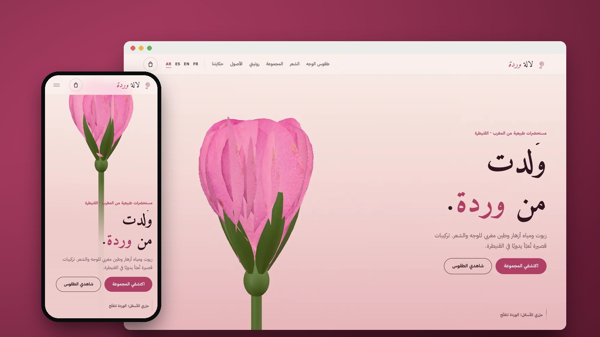</a>

# Lalla Warda · لالة وردة

**موقع علامة مستحضرات تجميل طبيعية من القنيطرة: وردة ثلاثية الأبعاد تتفتّح عن قارورة سيروم، وكل منتج يعرض مكوّناته وطريقة وضعه على الوجه والشعر.**

[English](README.md) · [Français](README.fr.md) · [Español](README.es.md) · **العربية**

[](https://hoshuko.github.io/lalla-warda/ar.html) [](https://hoshuko.github.io/lalla-warda/media/video/169-ar.mp4) [](#اللغات) [](LICENSE)

</div>

<div dir="rtl">

## لمحة

<a href="https://hoshuko.github.io/lalla-warda/media/video/169-ar.mp4">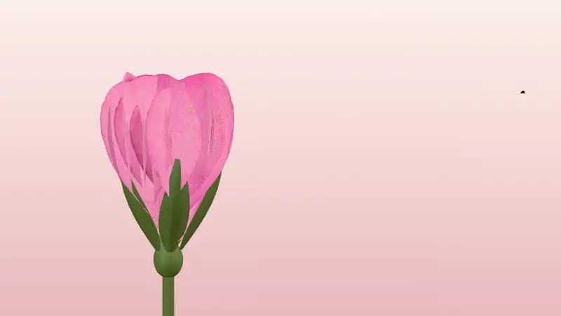</a>

بداية الفيديو الترويجي ذي الستين ثانية: الوردة تتفتّح، وبتلاتها تتطاير، وقارورة السيروم تخرج من قلبها. [← شاهد الفيديو الترويجي كاملاً](https://hoshuko.github.io/lalla-warda/media/video/169-ar.mp4)

## أبرز ما في الموقع

- **وُلدت من وردة.** مع التمرير تتفتّح وردة دمشقية ثلاثية الأبعاد، وتتطاير بتلاتها، وتخرج قارورة إكسير الورد من قلبها، ثم تأخذ المكوّنات الخمسة للتركيبة أماكنها حولها مع نسبة كل مكوّن ومصدره.
- **بأطراف الأصابع.** زيت وبلسم وطين ورذاذ زهري مرسومة على بشرة حقيقية بتقنية WebGL: بروز ولمعان وشفافية وانكسار الضوء في الزيت.
- **طقوس الوجه.** أربع خطوات على وجه حقيقي: الرذاذ، ثم قناع الغاسول منطقة بعد منطقة، ثم الشطف، ثم قطرات الإكسير، مع مؤقّت والمناطق التي يجب تجنّبها.
- **تحت المجهر.** شعرة ثلاثية الأبعاد: تنفتح القشور، ويغلّف زيت الأركان الليفة، ثم تنغلق القشرة وتلمع.
- **ثمانية منتجات ومتجر بلا خادم.** تصفية، وقارورة ثلاثية الأبعاد تُدار بالإصبع مع عرض مفكّك لمكوّناتها، وقائمة INCI كاملة، وروتين في ثلاثة أسئلة، وسلة تكتب رسالة الطلب عبر واتساب. لا دفع عبر الإنترنت: الدفع عند الاستلام.
- **طريق الأزهار.** خريطة للمغرب مرسومة من سواحل Natural Earth، تصل كل مكوّن من منطقته إلى المشغل في القنيطرة.
- **أربع لغات، منها العربية.** الفرنسية والإنجليزية والإسبانية والعربية، مع تخطيط حقيقي من اليمين إلى اليسار وخطوط عربية (Amiri وIBM Plex Sans Arabic).

## لقطات الشاشة

| الحاسوب | الهاتف |
| :---: | :---: |
| 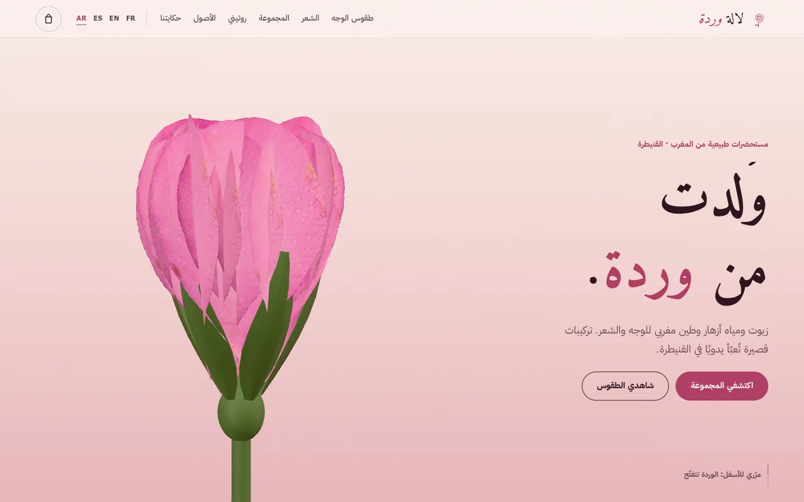 | 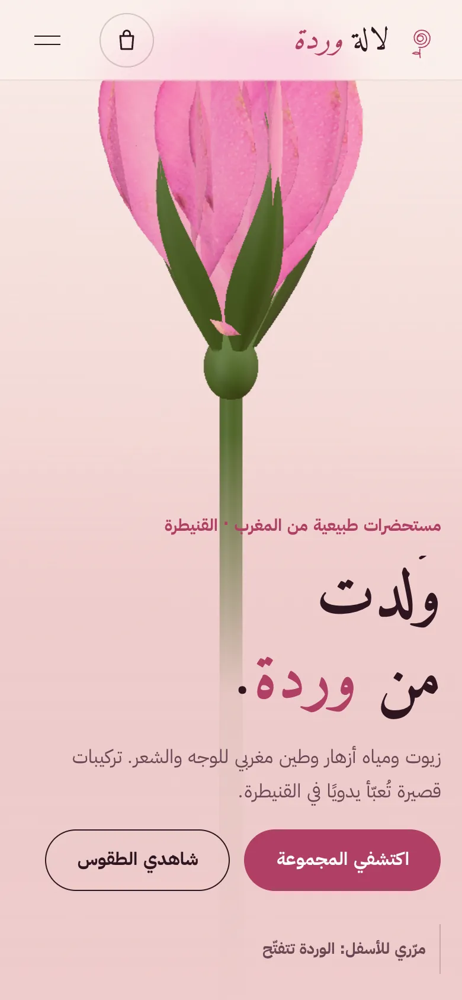 |

| | |
| :---: | :---: |
| 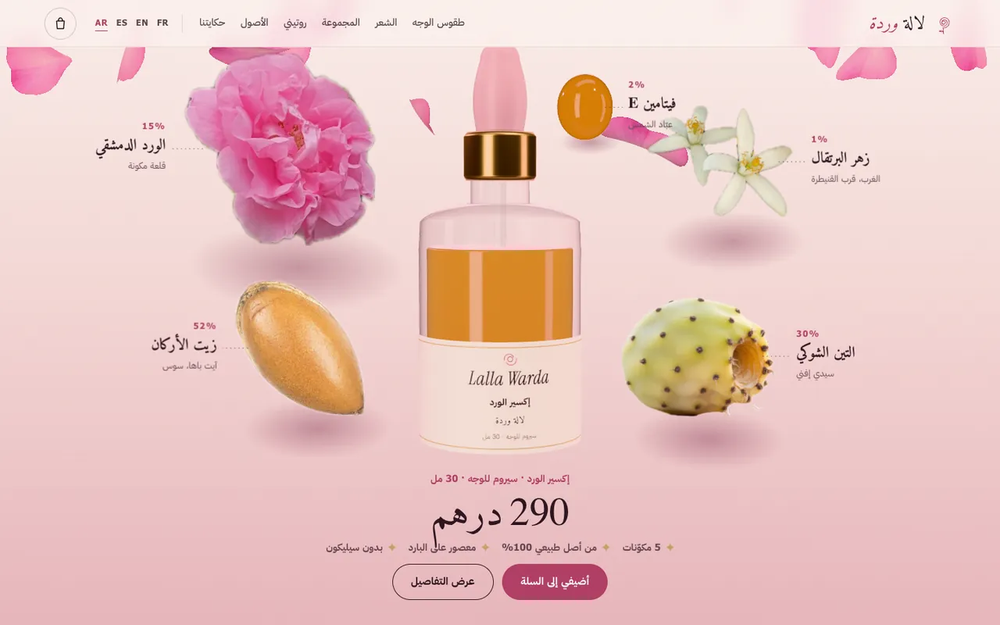<br><sub>التركيبة حول القارورة</sub> | 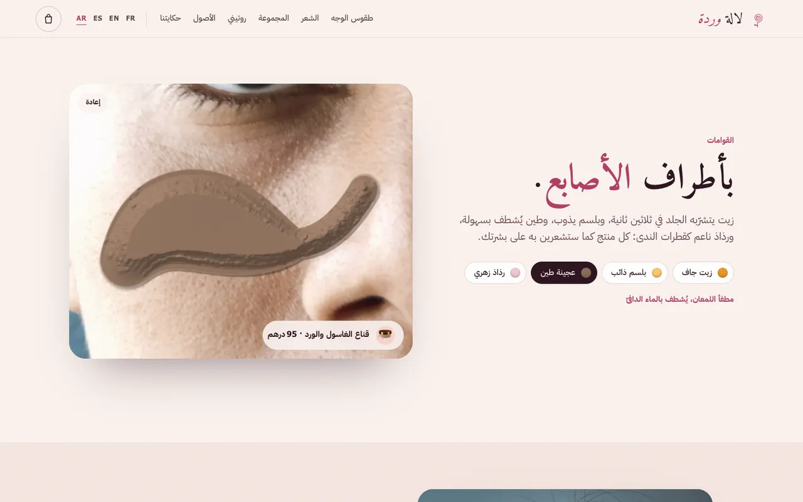<br><sub>القوامات على بشرة حقيقية</sub> |
| 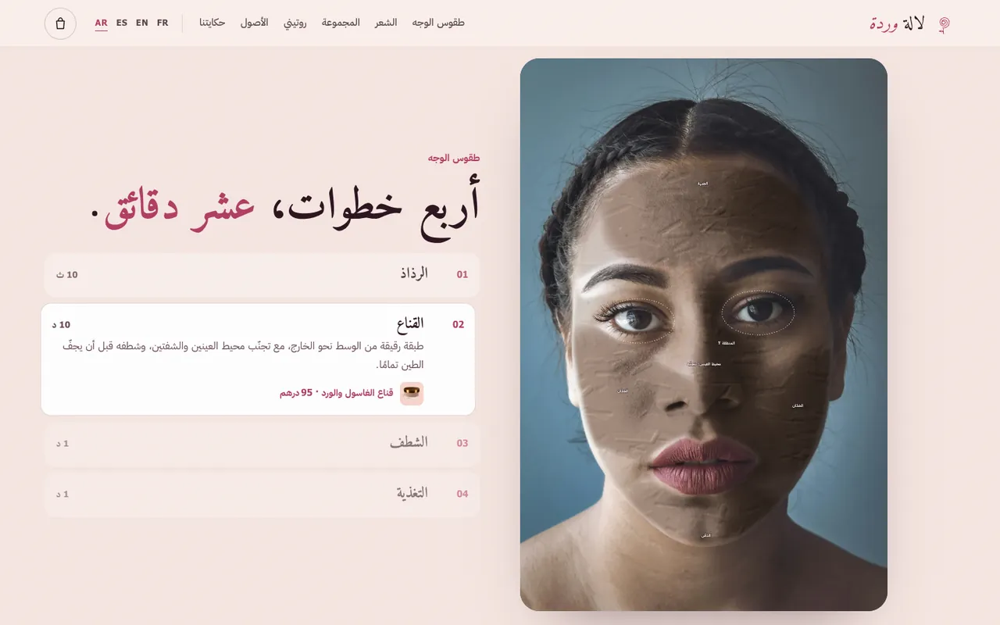<br><sub>طقوس الوجه</sub> | 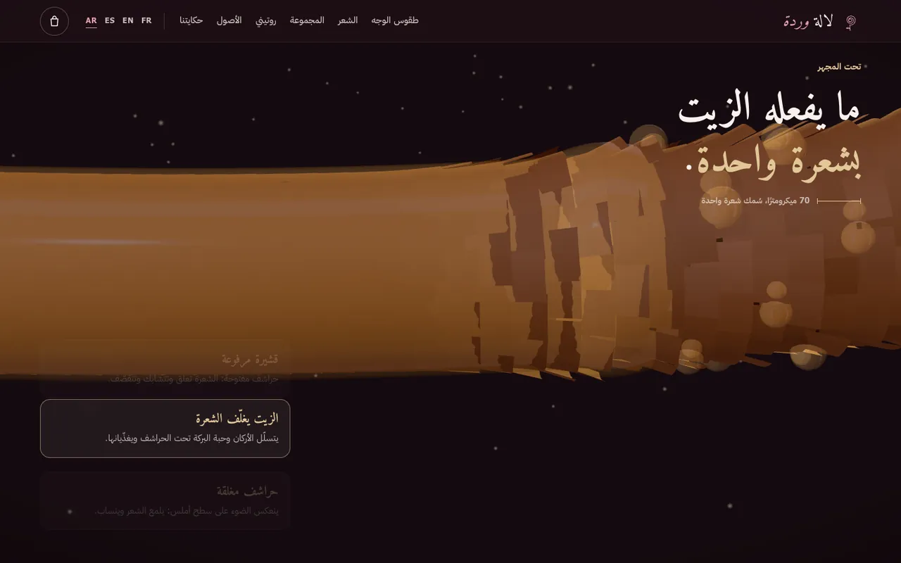<br><sub>شعرة تحت المجهر</sub> |
| 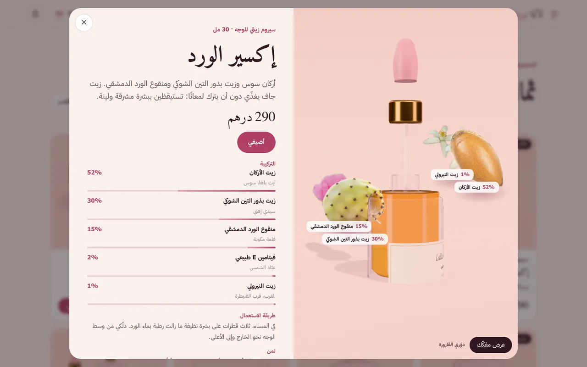<br><sub>بطاقة المنتج، عرض مفكّك</sub> | 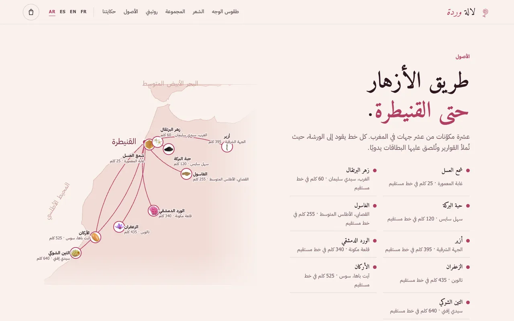<br><sub>طريق الأزهار</sub> |

## الفيديوهات الترويجية

ثلاثة مقاسات مدة كل منها 60 ثانية، بالفرنسية والإنجليزية والإسبانية والعربية، مُولَّدة صورةً صورة من المشاهد ثلاثية الأبعاد في الموقع، مع موسيقى ومؤثرات صوتية مُركَّبة بالكامل (بلا عيّنات ولا أصوات محمية بحقوق). انقر على الملصق لتشغيل الفيديو.

| أفقي · 16:9 | منشور · 4:5 | عمودي · 9:16 |
| :---: | :---: | :---: |
| <a href="https://hoshuko.github.io/lalla-warda/media/video/169-ar.mp4">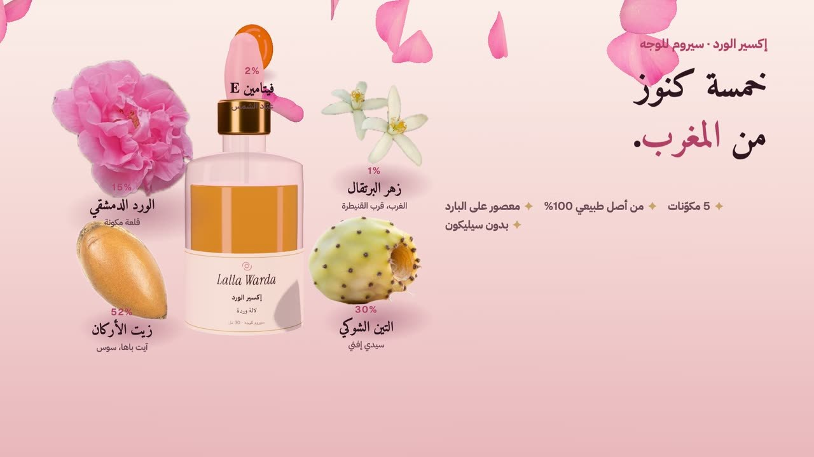</a> | <a href="https://hoshuko.github.io/lalla-warda/media/video/45-ar.mp4"></a> | <a href="https://hoshuko.github.io/lalla-warda/media/video/916-ar.mp4">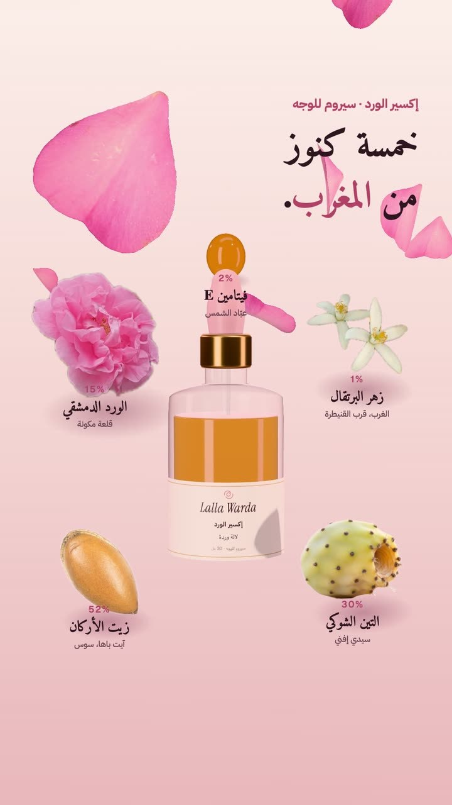</a> |
| <sub>يوتيوب والمواقع</sub> | <sub>منشورات فيسبوك وإنستغرام</sub> | <sub>Reels وStories وواتساب</sub> |

لغات أخرى (16:9): [EN](https://hoshuko.github.io/lalla-warda/media/video/169-en.mp4) · [FR](https://hoshuko.github.io/lalla-warda/media/video/169-fr.mp4) · [ES](https://hoshuko.github.io/lalla-warda/media/video/169-es.mp4)

## اللغات

الموقع متوفّر بالفرنسية (`index.html`، اللغة الافتراضية) والإنجليزية (`en.html`) والإسبانية (`es.html`) والعربية (`ar.html`، من اليمين إلى اليسار). كل لغة صفحة ثابتة، فترى محركات البحث ومعاينات الروابط النص الصحيح، ومبدّل اللغة موجود في شريط التنقّل.

## كيف صُنع

- [Three.js](https://threejs.org/) (برخصة MIT، مضمّنة في `assets/js/three.min.js` بالأجزاء المستعملة فقط) للوردة والقوارير الزجاجية والمكوّنات وليفة الشعر وعارض المنتجات. تُشكَّل البتلات انطلاقاً من صورة بتلة حقيقية، ويجمع الزجاج بين حافة فرينل وسائل شفاف في إضاءة استوديو.
- القوامات مُظلِّل WebGL فوق صورة بشرة حقيقية: خريطة ارتفاع تُرسم مع حركة الإصبع تعطي البروز واللمعان والانكسار. وتُرسم طقوس الوجه على canvas بأقنعة مأخوذة من معالم الوجه.
- وحدات JavaScript بلا إطار عمل ولا خطوة بناء لتشغيله. المحتوى ونصوص الواجهة في ملف واحد لكل لغة (`assets/js/config.fr.js · config.en.js · config.es.js · config.ar.js`).
- من دون WebGL يعرض الموقع صوراً ثابتة بدل المشاهد ثلاثية الأبعاد، ويحترم `prefers-reduced-motion`، وقد جُرّب التخطيط ابتداءً من عرض 360 بكسل وفي الاتجاهين.
- الخصوصية أولاً: لا ملفات تعريف ارتباط ولا إحصاءات ولا طلبات إلى أطراف ثالثة، مع سياسة أمان محتوى (CSP) صارمة. تبقى السلة في المتصفح (`localStorage`) ولا يخرج منها شيء حتى تفتح الزبونة واتساب.

## التشغيل محلياً

تستعمل الصفحات وحدات JavaScript، لذا افتحها عبر خادم ويب لا كملف مباشرة. باستعمال Python:

```bash
git clone https://github.com/hoshuko/lalla-warda.git
cd lalla-warda
python3 -m http.server 8000
```

ثم افتح <http://localhost:8000>. ولنشره، ارفع المجلد إلى أي استضافة ثابتة (GitHub Pages وNetlify وApache وNginx…).

## التخصيص

كل المحتوى في `assets/js/config.fr.js` و`config.en.js` و`config.es.js` و`config.ar.js`: العلامة، ووسائل التواصل (واتساب وإنستغرام)، والعملة والتوصيل، والمنتجات الثمانية بتركيباتها وقوائم INCI وأشكال القوارير وألوانها، والقوامات، وخطوات الطقوس، والروتين، والمصادر بإحداثياتها، والأرقام، والآراء، والأسئلة الشائعة، ونصوص الواجهة. الخيار `demo: true` يُظهر تنبيه النموذج التجريبي ويمنع زرَّي واتساب وإنستغرام من مغادرة الصفحة؛ غيّره إلى `false` بعد إدخال البيانات الحقيقية. نصوص الصفحات في ملفات HTML، والألوان متغيّرات CSS في أعلى `assets/css/style.css`.

## الحقوق

الصور من Unsplash وويكيميديا كومنز، والخريطة من Natural Earth؛ كل الإسنادات في [CREDITS.md](CREDITS.md). الصور المقتبسة من أصول برخصة CC BY-SA تبقى تحت هذه الرخصة. الخطوط برخصة SIL Open Font License 1.1 ([`assets/fonts/OFL.txt`](assets/fonts/OFL.txt))، وThree.js برخصة MIT ([`assets/js/three.LICENSE.txt`](assets/js/three.LICENSE.txt)). العلامة ومؤسِّستها والمنتجات والأسعار والرقم والآراء كلها خيالية.

## الرخصة

الشيفرة منشورة برخصة [PolyForm Noncommercial License 1.0.0](LICENSE). يمكنك استعمالها ودراستها وتعديلها لأي غرض غير تجاري: مشاريع شخصية، تعلّم، تدريس، جمعيات. أما الاستعمال التجاري، كتسليم هذا النموذج لزبون مقابل أجر، فيتطلّب رخصة مستقلة: افتح issue في هذا المستودع لطلبها. الصور والخطوط تحتفظ برخصها الخاصة (انظر أعلاه).

## الأمان

وجدت ثغرة؟ أبلغ عنها بشكل خاص من تبويب **Security** في المستودع («Report a vulnerability») بدل فتح issue علنية. انظر [SECURITY.md](SECURITY.md).

## نماذج أخرى

جزء من سلسلة **Storefronts in motion** (واجهات متحرّكة)، مواقع متحرّكة مع التمرير للمتاجر المحلية:

- **[Maison Billot](https://github.com/hoshuko/maison-billot/blob/main/README.md)**: A scroll-animated website for an artisan butcher: beef explained cut by cut.
- **[Tafat](https://github.com/hoshuko/tafat/blob/main/README.md)**: A website for a women-run home cleaning team on the Kabylian coast: a squeegee wipes the window clean as you scroll.
- **[Atelier Nacre](https://github.com/hoshuko/atelier-nacre/blob/main/README.md)**: A website for a nail studio in Bordeaux: a gel set taken apart layer by layer, a colour try-on and online booking.
- **[Tiziri](https://github.com/hoshuko/tiziri/blob/main/README.md)**: A clothing boutique’s wardrobe online: every piece, photographed in the shop, is worn by a wooden mannequin that comes to life.

معرض الأعمال: <https://hoshuko.github.io/> · YouTube: <https://www.youtube.com/@Hosh-uko>

</div>
