<div align="center">

<a href="https://hoshuko.github.io/lalla-warda/es.html">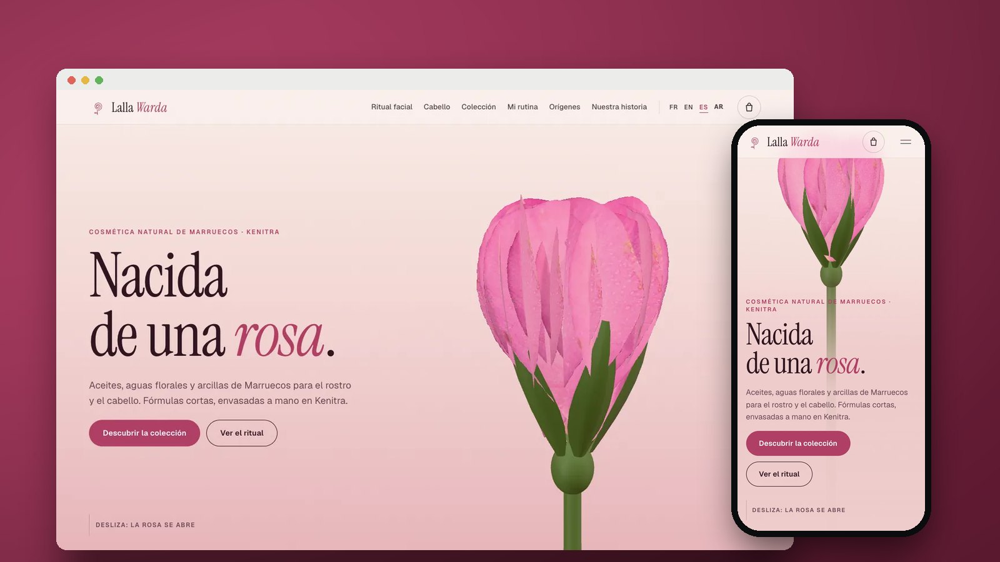</a>

# Lalla Warda

**La web de una marca de cosmética natural de Kenitra (Marruecos): una rosa en 3D se abre hasta revelar un frasco de sérum, y cada producto muestra de qué está hecho y cómo se aplica en el rostro y el cabello.**

[English](README.md) · [Français](README.fr.md) · **Español** · [العربية](README.ar.md)

[](https://hoshuko.github.io/lalla-warda/es.html) [](https://hoshuko.github.io/lalla-warda/media/video/169-es.mp4) [](#idiomas) [](LICENSE)

</div>

## Vista previa

<a href="https://hoshuko.github.io/lalla-warda/media/video/169-es.mp4">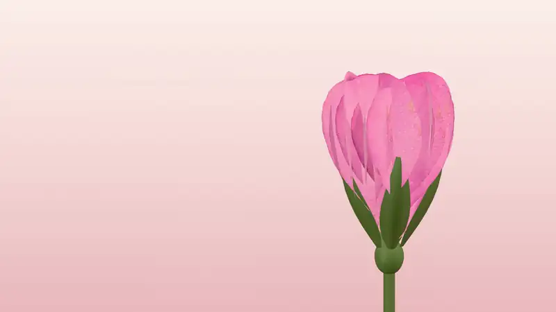</a>

El comienzo del vídeo promocional de 60 segundos: la rosa se abre, sus pétalos salen volando y el frasco de sérum surge de su corazón. [Ver el vídeo promocional completo →](https://hoshuko.github.io/lalla-warda/media/video/169-es.mp4)

## Lo más destacado

- **Nacida de una rosa.** Al desplazarte, una rosa de Damasco en 3D se abre, sus pétalos se dispersan, el frasco del Elixir de rosa surge de su corazón y los cinco ingredientes de la fórmula se colocan a su alrededor con su porcentaje y su origen.
- **Con la yema de los dedos.** Aceite, bálsamo, arcilla y bruma floral trazados sobre una piel real en WebGL: relieve, brillo, transparencia y la refracción del aceite.
- **El ritual facial.** Cuatro gestos sobre un rostro real: la bruma, la mascarilla de ghassoul aplicada zona por zona, el aclarado y las gotas de elixir, con un temporizador y las zonas que hay que evitar.
- **Al microscopio.** Un cabello en 3D: las escamas se levantan, el aceite de argán envuelve la fibra y la cutícula se cierra y brilla.
- **Ocho productos y una tienda sin servidor.** Filtros, un frasco 3D que se puede girar con una vista despiezada de sus ingredientes, lista INCI completa, una rutina en tres preguntas y un carrito que redacta el pedido por WhatsApp. Sin pagos en línea: pago contra reembolso.
- **La ruta de las flores.** Un mapa de Marruecos trazado a partir de las costas de Natural Earth, que une cada ingrediente desde su región hasta el taller de Kenitra.
- **Cuatro idiomas, árabe incluido.** Francés, inglés, español y árabe, con un auténtico diseño de derecha a izquierda y tipografías árabes (Amiri, IBM Plex Sans Arabic).

## Capturas de pantalla

| Ordenador | Móvil |
| :---: | :---: |
| 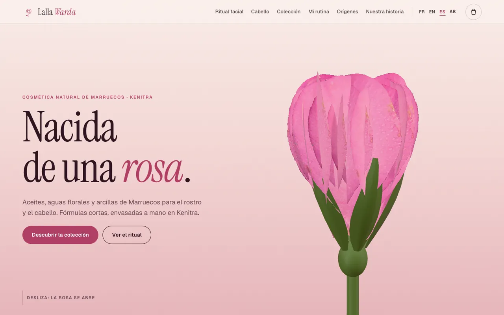 | 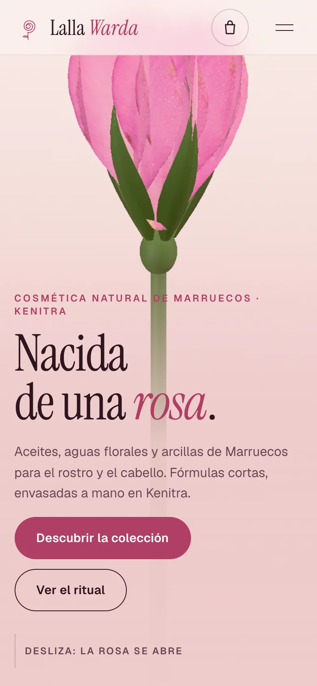 |

| | |
| :---: | :---: |
| 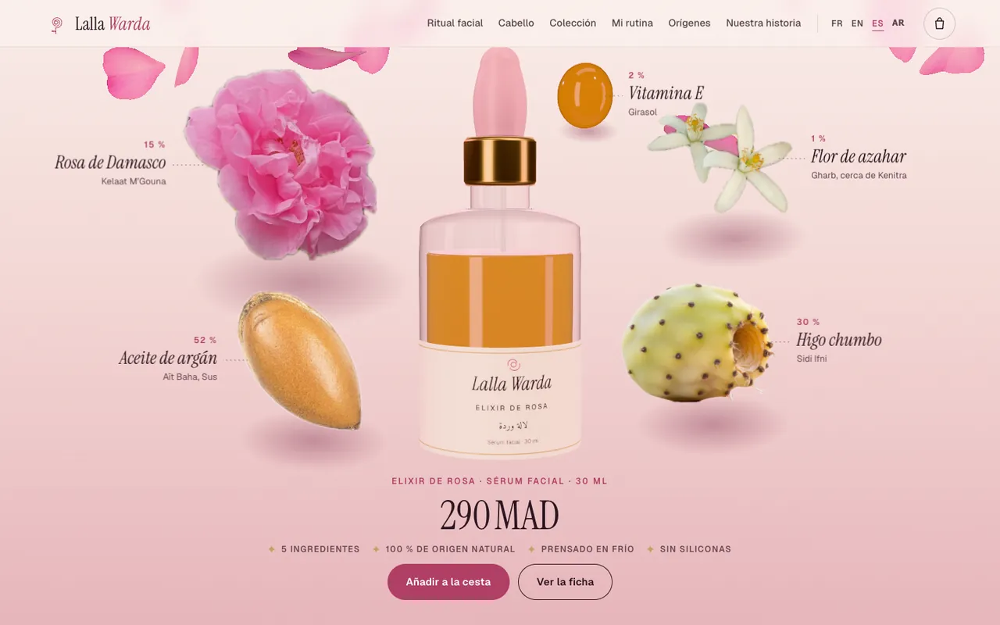<br><sub>La fórmula alrededor del frasco</sub> | 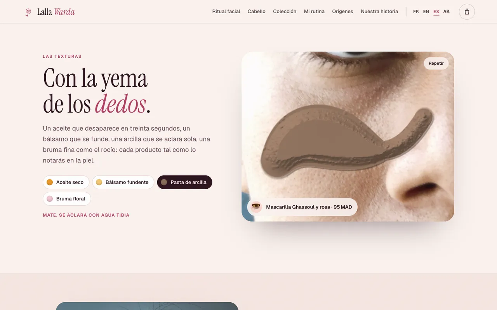<br><sub>Las texturas sobre una piel real</sub> |
| 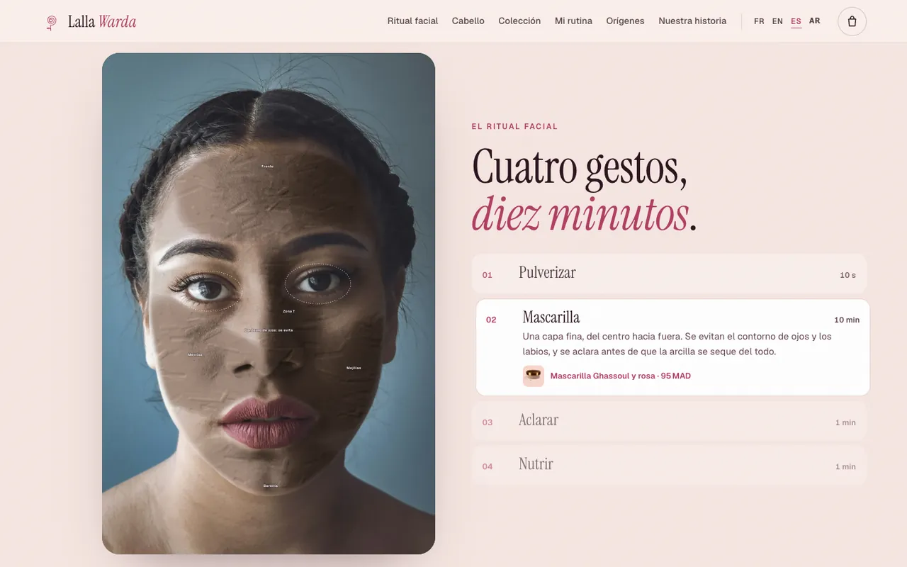<br><sub>El ritual facial</sub> | 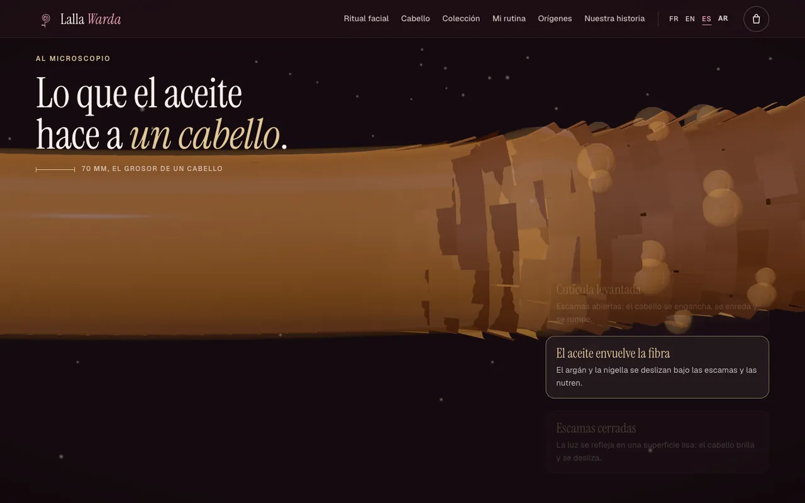<br><sub>Un cabello al microscopio</sub> |
| 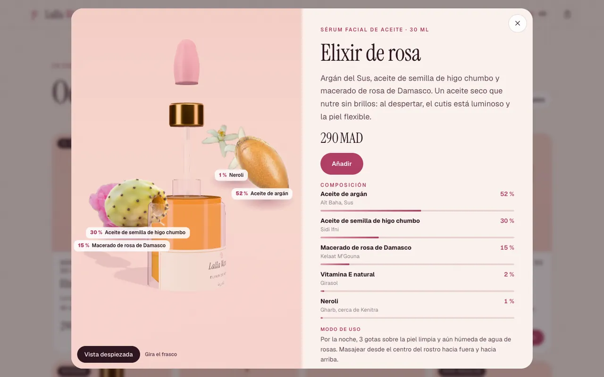<br><sub>Ficha de producto, vista despiezada</sub> | 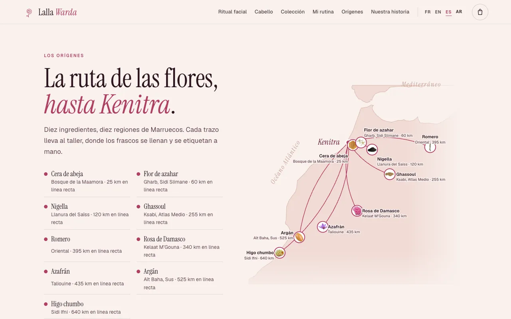<br><sub>La ruta de las flores</sub> |

## Vídeos promocionales

Tres formatos de 60 segundos en francés, inglés, español y árabe, generados fotograma a fotograma a partir de las escenas 3D de la web, con música y efectos de sonido sintetizados desde cero (sin muestras ni audio con derechos). Haz clic en un póster para ver el vídeo.

| Horizontal · 16:9 | Feed · 4:5 | Vertical · 9:16 |
| :---: | :---: | :---: |
| <a href="https://hoshuko.github.io/lalla-warda/media/video/169-es.mp4">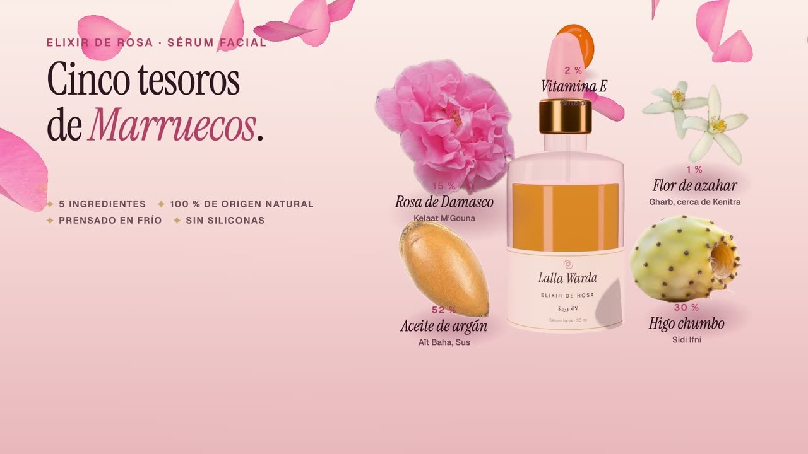</a> | <a href="https://hoshuko.github.io/lalla-warda/media/video/45-es.mp4"></a> | <a href="https://hoshuko.github.io/lalla-warda/media/video/916-es.mp4">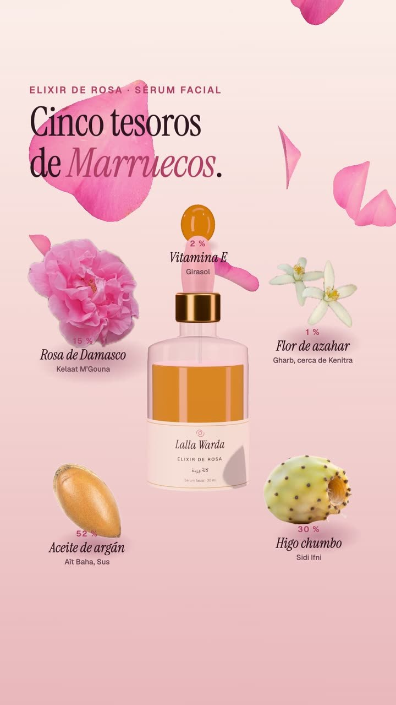</a> |
| <sub>YouTube, webs</sub> | <sub>Feed de Facebook e Instagram</sub> | <sub>Reels, Stories, WhatsApp</sub> |

Otros idiomas (16:9): [EN](https://hoshuko.github.io/lalla-warda/media/video/169-en.mp4) · [FR](https://hoshuko.github.io/lalla-warda/media/video/169-fr.mp4) · [AR](https://hoshuko.github.io/lalla-warda/media/video/169-ar.mp4)

## Idiomas

La web está disponible en francés (`index.html`, por defecto), inglés (`en.html`), español (`es.html`) y árabe (`ar.html`, de derecha a izquierda). Cada idioma es una página estática, así que los buscadores y las vistas previas de enlaces ven el texto correcto; el selector de idioma está en la navegación.

## Por dentro

- [Three.js](https://threejs.org/) (MIT, incluido en `assets/js/three.min.js` solo con las partes que se usan) para la rosa, los frascos de vidrio, los ingredientes, la fibra del cabello y el visor de productos. Los pétalos se deforman en el procesador a partir de la foto de un pétalo real; el vidrio combina un borde de Fresnel y un líquido transmisivo con iluminación de estudio.
- Las texturas son un shader WebGL sobre la foto de una piel real: un mapa de alturas dibujado a lo largo del gesto da el relieve, los brillos y la refracción. El ritual facial se dibuja en un canvas con máscaras trazadas a partir de los puntos de referencia del rostro.
- Módulos de JavaScript, sin frameworks ni compilación para ponerla en marcha. Los contenidos y los textos de la interfaz están en un archivo por idioma (`assets/js/config.fr.js · config.en.js · config.es.js · config.ar.js`).
- Sin WebGL, la web muestra fotos e imágenes fijas en lugar de las escenas 3D; se respeta `prefers-reduced-motion` y el diseño está comprobado desde 360 px de ancho, en ambos sentidos de escritura.
- Privacidad desde el diseño: sin cookies, sin analítica, sin peticiones a terceros y con una política de seguridad de contenido (CSP) estricta. El carrito se guarda en el navegador (`localStorage`) y nada sale de él hasta que la clienta abre WhatsApp.

## Ejecutar en local

Las páginas usan módulos de JavaScript: ábrelas desde un servidor web y no directamente como archivo. Con Python:

```bash
git clone https://github.com/hoshuko/lalla-warda.git
cd lalla-warda
python3 -m http.server 8000
```

Después abre <http://localhost:8000>. Para publicarla, sube la carpeta a cualquier alojamiento estático (GitHub Pages, Netlify, Apache, Nginx…).

## Personalizar

Todo el contenido está en `assets/js/config.fr.js`, `config.en.js`, `config.es.js` y `config.ar.js`: marca, datos de contacto (WhatsApp, Instagram), moneda y envío, los ocho productos con su fórmula, su lista INCI, la forma y los colores del frasco, las texturas, los pasos de los rituales, la rutina, los orígenes con sus coordenadas, las cifras clave, las opiniones, las preguntas frecuentes y los textos de la interfaz. `demo: true` muestra el aviso de demostración e impide que los botones de WhatsApp e Instagram salgan de la página; cámbialo a `false` cuando tengas los datos reales. Los textos de las páginas están en los archivos HTML y los colores son variables CSS al principio de `assets/css/style.css`.

## Créditos

Las fotos proceden de Unsplash y Wikimedia Commons, y el mapa de Natural Earth; todas las atribuciones están en [CREDITS.md](CREDITS.md). Las imágenes adaptadas de originales con licencia CC BY-SA conservan esa licencia. Las fuentes tienen licencia SIL Open Font License 1.1 ([`assets/fonts/OFL.txt`](assets/fonts/OFL.txt)); Three.js tiene licencia MIT ([`assets/js/three.LICENSE.txt`](assets/js/three.LICENSE.txt)). La marca, su fundadora, los productos, los precios, el teléfono y las opiniones son ficticios.

## Licencia

El código se publica con la [licencia PolyForm Noncommercial 1.0.0](LICENSE). Puedes usarlo, estudiarlo y modificarlo para cualquier fin no comercial: proyectos personales, aprendizaje, docencia, asociaciones. El uso comercial, por ejemplo entregar esta maqueta a un cliente, requiere una licencia aparte: abre una incidencia (issue) en este repositorio para solicitarla. Las fotos y las fuentes conservan sus propias licencias (ver arriba).

## Seguridad

¿Has encontrado una vulnerabilidad? Comunícala de forma privada desde la pestaña **Security** del repositorio («Report a vulnerability»), no en una incidencia pública. Consulta [SECURITY.md](SECURITY.md).

## Más maquetas

Forma parte de **Escaparates en movimiento**, una serie de webs animadas al desplazarse para comercios de barrio:

- **[Maison Billot](https://github.com/hoshuko/maison-billot/blob/main/README.es.md)**: La web animada de una carnicería artesanal: el despiece del vacuno explicado pieza a pieza.
- **[Tafat](https://github.com/hoshuko/tafat/blob/main/README.es.md)**: La web de un equipo de mujeres que limpia casas en la costa de Cabilia: al desplazarte, una rasqueta limpia el cristal.
- **[Atelier Nacre](https://github.com/hoshuko/atelier-nacre/blob/main/README.es.md)**: La web de un estudio de uñas en Burdeos: una manicura desmontada capa a capa, un probador de color y reservas en línea.
- **[Tiziri](https://github.com/hoshuko/tiziri/blob/main/README.es.md)**: El armario de una tienda de ropa en línea: cada prenda, fotografiada en la tienda, la lleva un maniquí de madera que cobra vida.

Portafolio: <https://hoshuko.github.io/es.html> · YouTube: <https://www.youtube.com/@Hosh-uko>
