<div align="center">

<a href="https://hoshuko.github.io/lalla-warda/">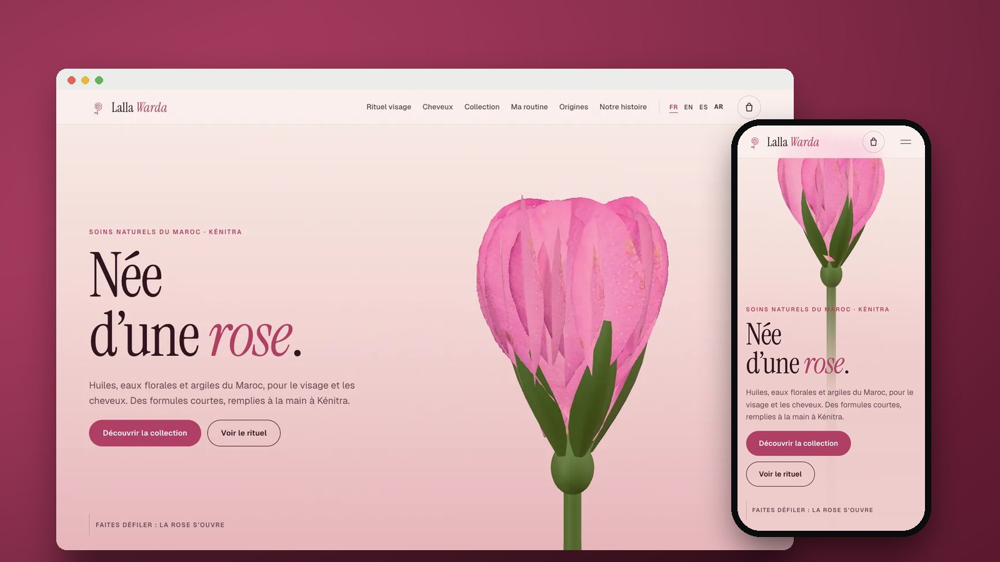</a>

# Lalla Warda

**Le site d’une marque de cosmétiques naturels de Kénitra : une rose en 3D s’ouvre sur un flacon de sérum, et chaque soin montre ce qu’il contient et comment il s’applique sur le visage et les cheveux.**

[English](README.md) · **Français** · [Español](README.es.md) · [العربية](README.ar.md)

[](https://hoshuko.github.io/lalla-warda/) [](https://hoshuko.github.io/lalla-warda/media/video/169-fr.mp4) [](#langues) [](LICENSE)

</div>

## Aperçu

<a href="https://hoshuko.github.io/lalla-warda/media/video/169-fr.mp4">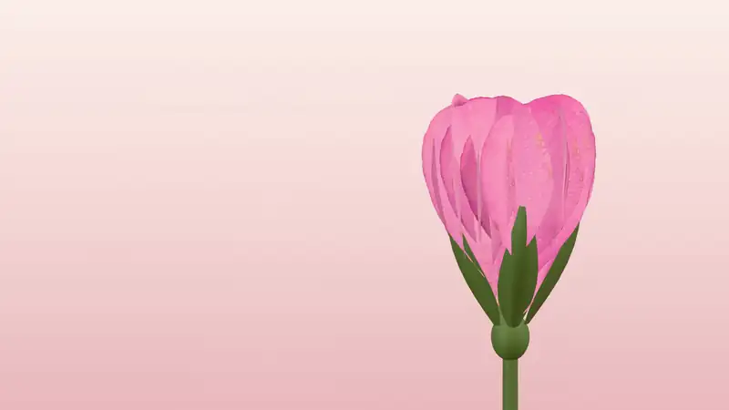</a>

Le début de la vidéo promo de 60 secondes : la rose s’ouvre, ses pétales s’envolent et le flacon de sérum sort de son cœur. [Voir la vidéo promo en entier →](https://hoshuko.github.io/lalla-warda/media/video/169-fr.mp4)

## Points forts

- **Née d’une rose.** Au défilement, une rose de Damas en 3D s’ouvre, ses pétales s’envolent, le flacon de l’Élixir de rose sort de son cœur et les cinq ingrédients de la formule viennent se placer autour de lui, avec leur part et leur origine.
- **Du bout des doigts.** Huile, baume, argile et brume florale tracés sur une vraie peau en WebGL : relief, brillance, transparence et réfraction de l’huile.
- **Le rituel visage.** Quatre gestes sur un vrai visage : la brume, le masque au ghassoul posé zone par zone, le rinçage puis les gouttes d’élixir, avec un minuteur et les zones à éviter.
- **Au microscope.** Un cheveu en 3D : les écailles se soulèvent, l’huile d’argan gaine la fibre, puis la cuticule se referme et brille.
- **Huit soins et une boutique sans serveur.** Filtres, flacon 3D à faire tourner avec une vue éclatée de ses ingrédients, liste INCI complète, routine en trois questions et panier qui rédige la commande WhatsApp. Aucun paiement en ligne : paiement à la livraison.
- **La route des fleurs.** Une carte du Maroc tracée d’après les côtes de Natural Earth, qui relie chaque ingrédient de sa région jusqu’à l’atelier de Kénitra.
- **Quatre langues, arabe compris.** Français, anglais, espagnol et arabe, avec une vraie mise en page de droite à gauche et des polices arabes (Amiri, IBM Plex Sans Arabic).

## Captures d’écran

| Ordinateur | Mobile |
| :---: | :---: |
| 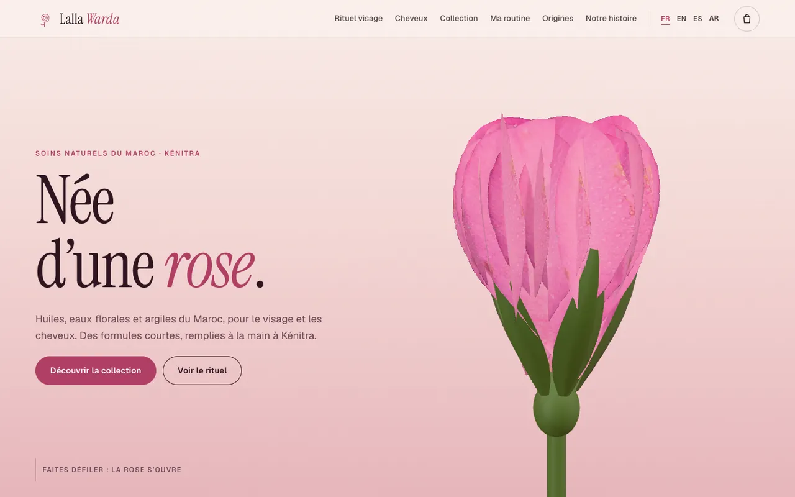 | 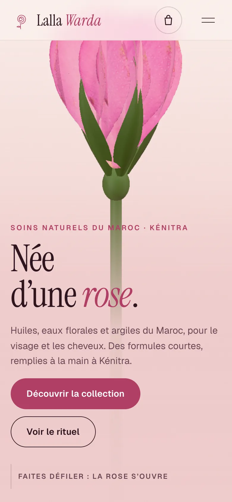 |

| | |
| :---: | :---: |
| 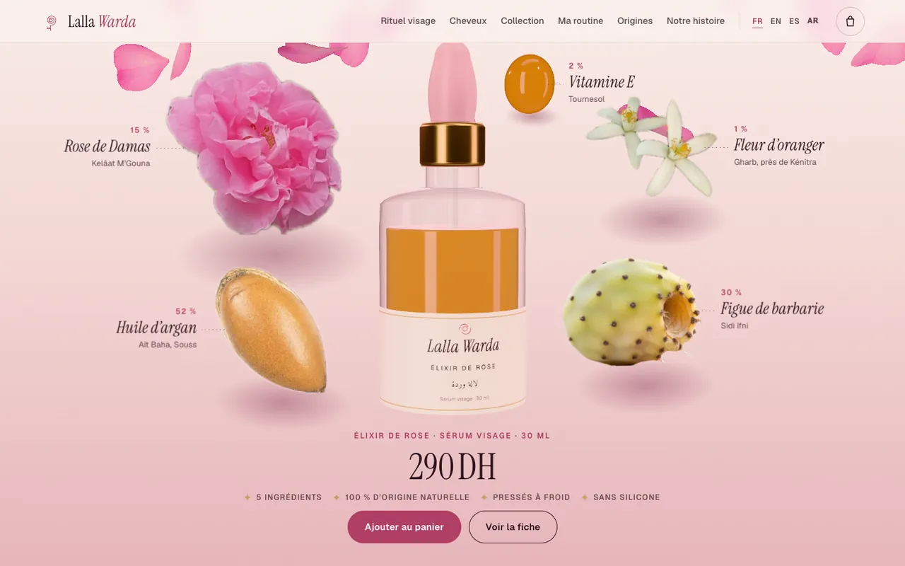<br><sub>La formule autour du flacon</sub> | 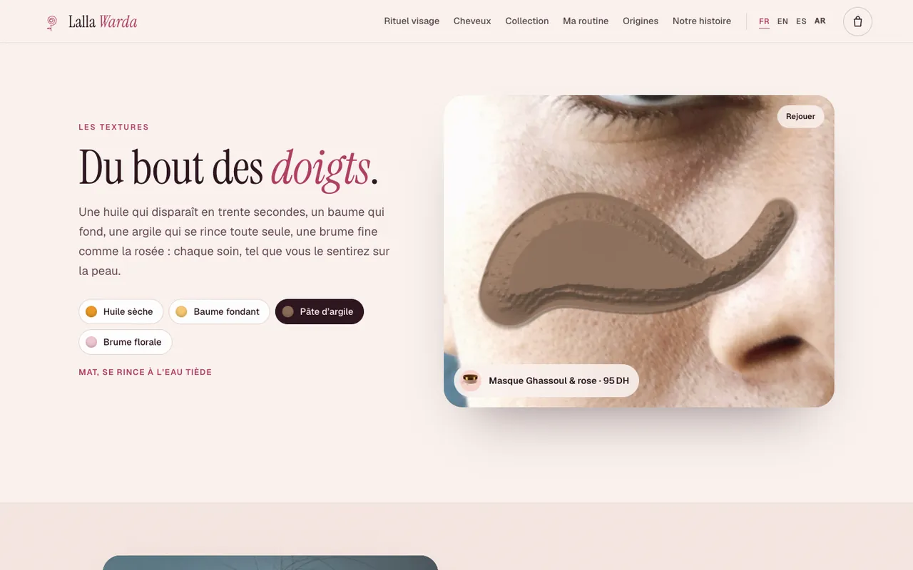<br><sub>Les textures sur une vraie peau</sub> |
| 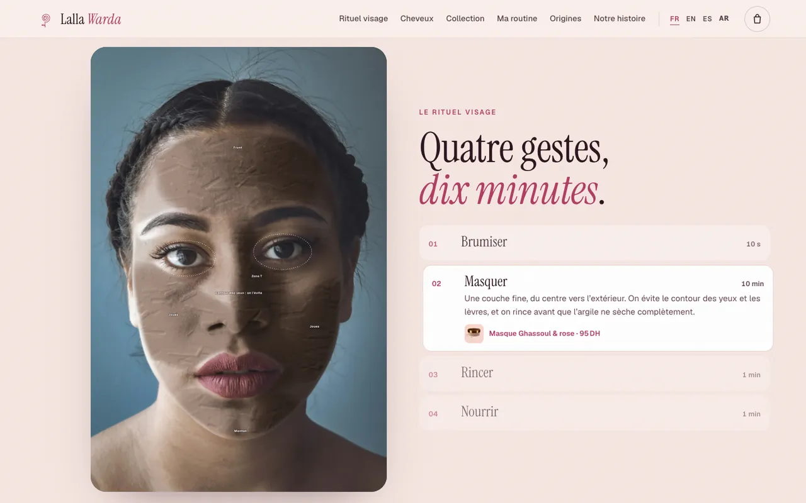<br><sub>Le rituel visage</sub> | 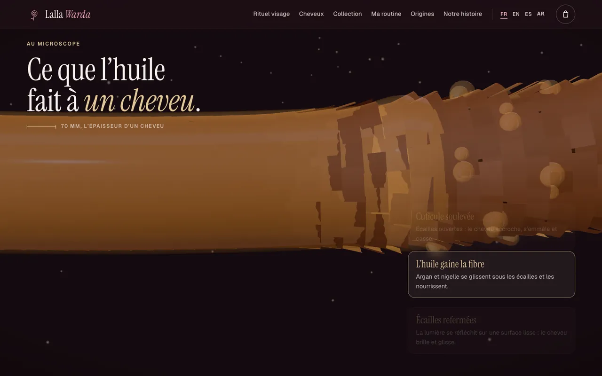<br><sub>Un cheveu au microscope</sub> |
| 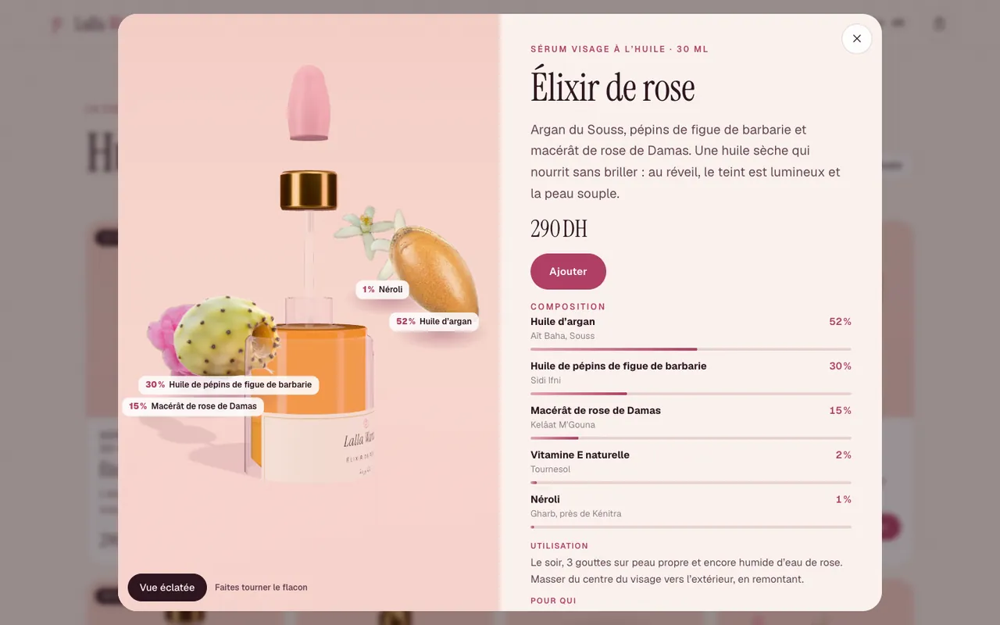<br><sub>Fiche produit, vue éclatée</sub> | 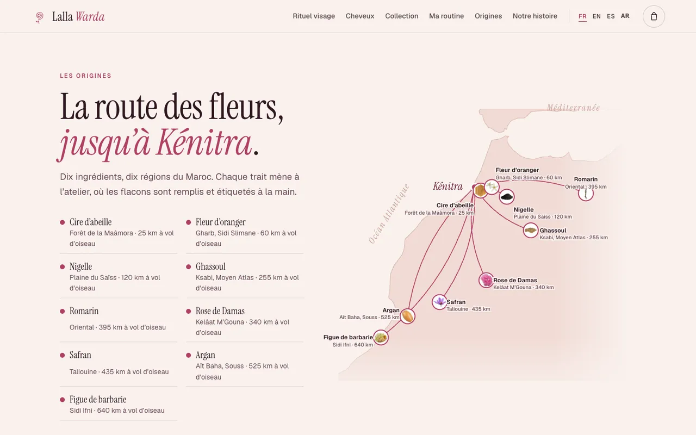<br><sub>La route des fleurs</sub> |

## Vidéos promo

Trois formats de 60 secondes en français, en anglais, en espagnol et en arabe, rendus image par image à partir des scènes 3D du site, avec une musique et des bruitages synthétisés de toutes pièces (aucun échantillon, aucun son sous droits). Cliquez sur une affiche pour lancer la vidéo.

| Paysage · 16:9 | Fil · 4:5 | Vertical · 9:16 |
| :---: | :---: | :---: |
| <a href="https://hoshuko.github.io/lalla-warda/media/video/169-fr.mp4">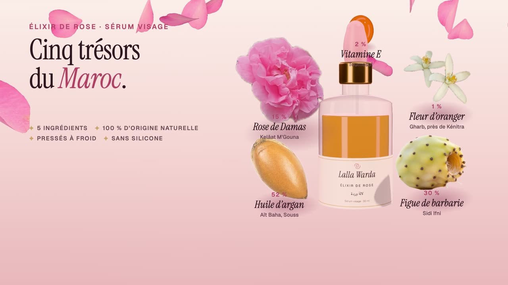</a> | <a href="https://hoshuko.github.io/lalla-warda/media/video/45-fr.mp4">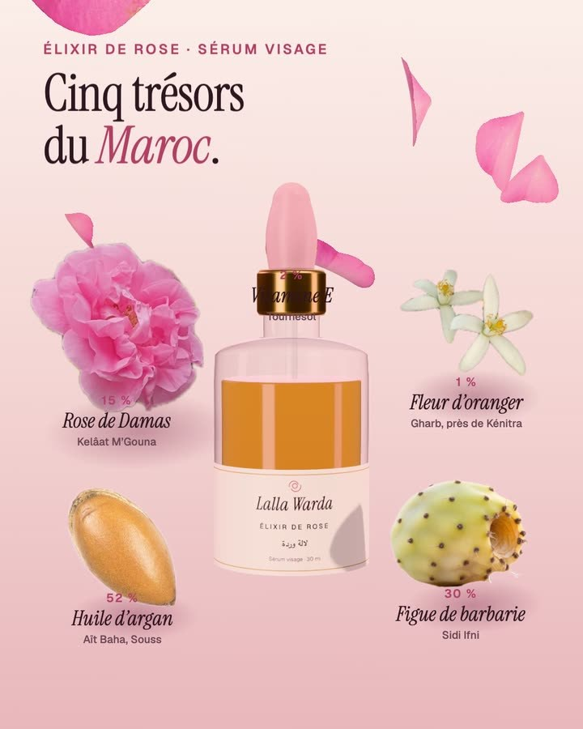</a> | <a href="https://hoshuko.github.io/lalla-warda/media/video/916-fr.mp4">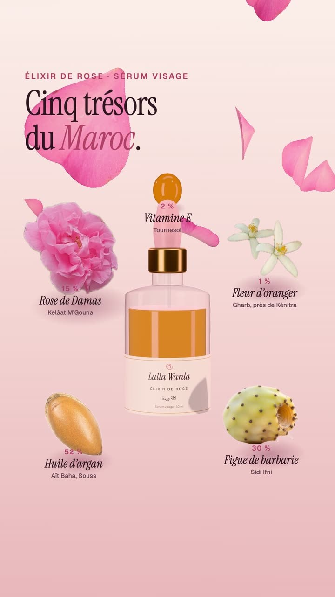</a> |
| <sub>YouTube, sites web</sub> | <sub>Fils Facebook et Instagram</sub> | <sub>Reels, Stories, WhatsApp</sub> |

Autres langues (16:9): [EN](https://hoshuko.github.io/lalla-warda/media/video/169-en.mp4) · [ES](https://hoshuko.github.io/lalla-warda/media/video/169-es.mp4) · [AR](https://hoshuko.github.io/lalla-warda/media/video/169-ar.mp4)

## Langues

Le site existe en français (`index.html`, par défaut), en anglais (`en.html`), en espagnol (`es.html`) et en arabe (`ar.html`, de droite à gauche). Chaque langue est une page statique : les moteurs de recherche et les aperçus de liens voient le bon texte, et le sélecteur de langue se trouve dans la navigation.

## Sous le capot

- [Three.js](https://threejs.org/) (MIT, intégré dans `assets/js/three.min.js`, réduit aux parties utilisées) pour la rose, les flacons en verre, les ingrédients, la fibre du cheveu et la visionneuse des soins. Les pétales sont déformés sur le processeur à partir de la photo d’un vrai pétale ; le verre combine un bord de Fresnel et un liquide transmissif dans un éclairage de studio.
- Les textures sont un shader WebGL posé sur la photo d’une vraie peau : une carte de hauteur dessinée au fil du geste donne le relief, les reflets et la réfraction. Le rituel visage est dessiné sur un canvas, avec des masques tracés à partir des repères du visage.
- Des modules JavaScript, sans framework ni compilation pour le lancer. Les contenus et les textes de l’interface tiennent dans un fichier par langue (`assets/js/config.fr.js · config.en.js · config.es.js · config.ar.js`).
- Sans WebGL, le site affiche des photos et des images fixes à la place des scènes 3D ; `prefers-reduced-motion` est respecté, et la mise en page est vérifiée dès 360 px de large, dans les deux sens d’écriture.
- Respect de la vie privée : ni cookies, ni mesure d’audience, ni requête vers un tiers, et une politique de sécurité du contenu (CSP) stricte. Le panier reste dans le navigateur (`localStorage`) et rien n’en sort tant que la cliente n’ouvre pas WhatsApp.

## Lancer en local

Les pages utilisent des modules JavaScript : ouvrez-les par un serveur web plutôt qu’en double-cliquant sur le fichier. Avec Python :

```bash
git clone https://github.com/hoshuko/lalla-warda.git
cd lalla-warda
python3 -m http.server 8000
```

Ouvrez ensuite <http://localhost:8000>. Pour le mettre en ligne, déposez le dossier chez n’importe quel hébergeur statique (GitHub Pages, Netlify, Apache, Nginx…).

## Personnaliser

Tout le contenu est dans `assets/js/config.fr.js`, `config.en.js`, `config.es.js` et `config.ar.js` : marque, coordonnées (WhatsApp, Instagram), devise et livraison, les huit soins avec leur formule, leur liste INCI, la forme et les couleurs du flacon, les textures, les étapes des rituels, la routine, les origines et leurs coordonnées, les chiffres clés, les avis, la FAQ et les textes de l’interface. `demo: true` affiche la mention de démonstration et empêche les boutons WhatsApp et Instagram de quitter la page ; passez-le à `false` une fois les vraies coordonnées renseignées. Les textes des pages sont dans les fichiers HTML, et les couleurs sont des variables CSS en tête de `assets/css/style.css`.

## Crédits

Les photos viennent d’Unsplash et de Wikimedia Commons, et la carte de Natural Earth ; toutes les attributions sont dans [CREDITS.md](CREDITS.md). Les images adaptées d’originaux sous CC BY-SA restent sous cette licence. Les polices sont sous licence SIL Open Font License 1.1 ([`assets/fonts/OFL.txt`](assets/fonts/OFL.txt)) ; Three.js est sous licence MIT ([`assets/js/three.LICENSE.txt`](assets/js/three.LICENSE.txt)). La marque, sa fondatrice, les soins, les prix, le numéro et les avis sont fictifs.

## Licence

Le code est publié sous [licence PolyForm Noncommercial 1.0.0](LICENSE). Vous pouvez l’utiliser, l’étudier et le modifier pour tout usage non commercial : projets personnels, apprentissage, enseignement, associations. Un usage commercial, par exemple livrer cette maquette à un client, demande une licence à part : ouvrez un ticket (issue) sur ce dépôt pour en faire la demande. Les photos et les polices gardent leurs propres licences (voir plus haut).

## Sécurité

Vous avez trouvé une faille ? Signalez-la en privé depuis l’onglet **Security** du dépôt (« Report a vulnerability »), plutôt que dans un ticket public. Voir [SECURITY.md](SECURITY.md).

## Autres maquettes

Cette maquette fait partie de **Vitrines en mouvement**, une série de sites animés au défilement pour les commerces de proximité :

- **[Maison Billot](https://github.com/hoshuko/maison-billot/blob/main/README.fr.md)**: Le site vitrine animé d’une boucherie artisanale : la découpe du bœuf expliquée pièce par pièce.
- **[Tafat](https://github.com/hoshuko/tafat/blob/main/README.fr.md)**: Le site d’une équipe de femmes qui fait le ménage à domicile sur la côte kabyle : au défilement, une raclette nettoie la vitre.
- **[Atelier Nacre](https://github.com/hoshuko/atelier-nacre/blob/main/README.fr.md)**: Le site d’un atelier de prothésiste ongulaire à Bordeaux : une pose démontée couche par couche, un essayage de couleur et la réservation en ligne.
- **[Tiziri](https://github.com/hoshuko/tiziri/blob/main/README.fr.md)**: La garde-robe d’une boutique de vêtements en ligne : chaque pièce, photographiée en magasin, est portée par un mannequin en bois qui prend vie.

Portfolio: <https://hoshuko.github.io/> · YouTube: <https://www.youtube.com/@Hosh-uko>
