<div align="center">

<a href="https://hoshuko.github.io/lalla-warda/en.html">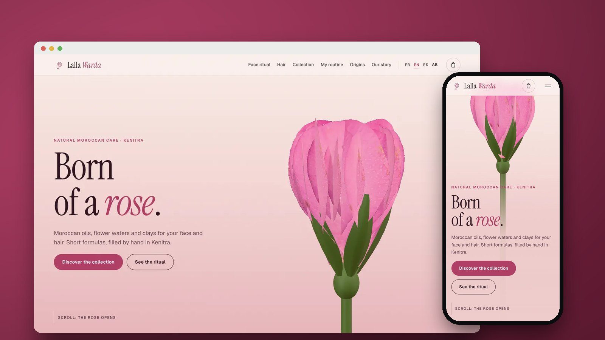</a>

# Lalla Warda

**The website of a natural cosmetics brand from Kenitra, Morocco: a 3D rose blooms into a serum bottle, and every product shows what it is made of and how it goes on the face and hair.**

**English** · [Français](README.fr.md) · [Español](README.es.md) · [العربية](README.ar.md)

[](https://hoshuko.github.io/lalla-warda/en.html) [](https://hoshuko.github.io/lalla-warda/media/video/169-en.mp4) [](#languages) [](LICENSE)

</div>

## Preview

<a href="https://hoshuko.github.io/lalla-warda/media/video/169-en.mp4"></a>

The opening of the 60-second promo video: the rose opens, its petals fly off and the serum bottle rises from its heart. [Watch the full promo video →](https://hoshuko.github.io/lalla-warda/media/video/169-en.mp4)

## Highlights

- **Born of a rose.** A 3D Damask rose blooms as you scroll, its petals scatter, the Rose Elixir bottle rises from its heart and the five ingredients of the formula settle around it with their share and origin.
- **At your fingertips.** Oil, balm, clay and floral mist drawn on real skin in WebGL: relief, gloss, transparency and the refraction of the oil.
- **The face ritual.** Four steps on a real face: mist, the ghassoul mask brushed on zone by zone, the rinse, then the elixir drops, with a timer and the areas to avoid.
- **Under the microscope.** A single hair in 3D: the scales lift, argan oil sheathes the fibre, and the cuticle closes and shines.
- **Eight products and a shop without a server.** Filters, a 3D bottle you can spin with an exploded view of its ingredients, full INCI lists, a three-question routine finder, and a cart that writes the WhatsApp order message. No online payment: cash on delivery.
- **The flower route.** A map of Morocco drawn from Natural Earth coastlines, tracing each ingredient from its region to the workshop in Kenitra.
- **Four languages, right to left included.** French, English, Spanish and Arabic, with a true right-to-left layout and Arabic typefaces (Amiri, IBM Plex Sans Arabic).

## Screenshots

| Desktop | Mobile |
| :---: | :---: |
| 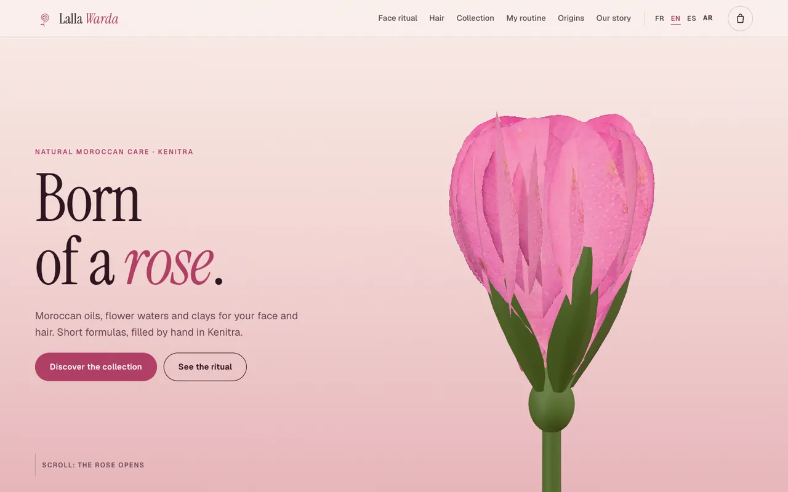 | 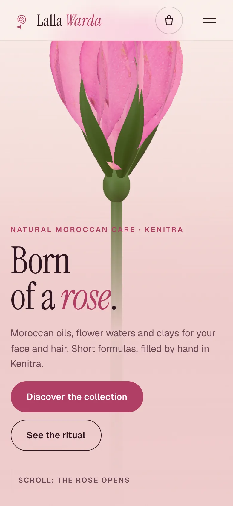 |

| | |
| :---: | :---: |
| 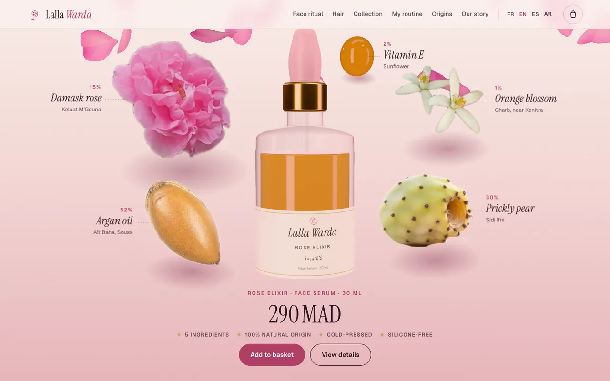<br><sub>The formula around the bottle</sub> | 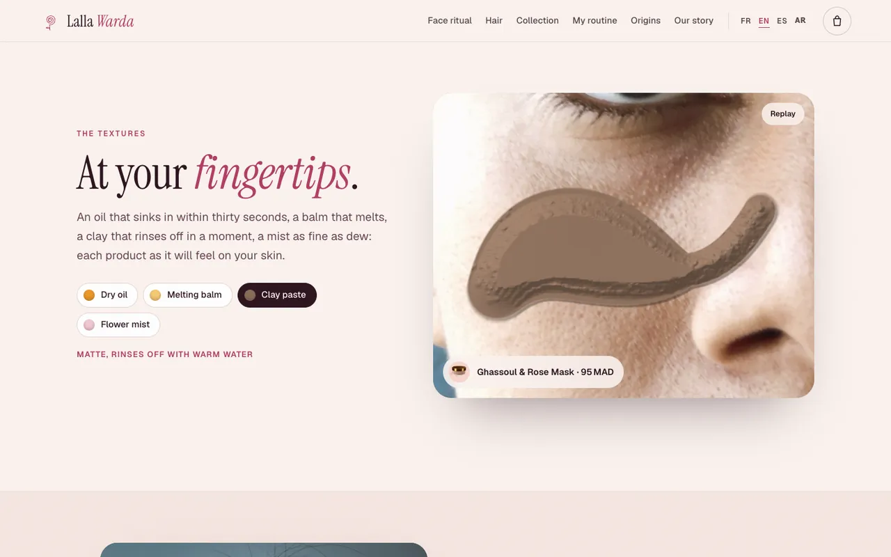<br><sub>Textures on real skin</sub> |
| 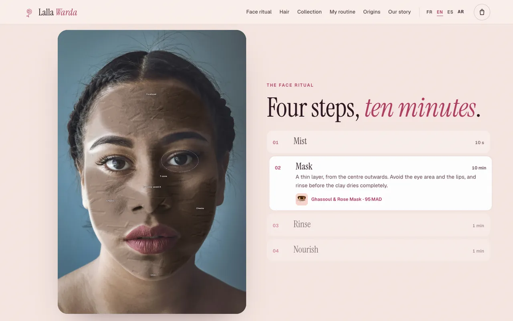<br><sub>The face ritual</sub> | 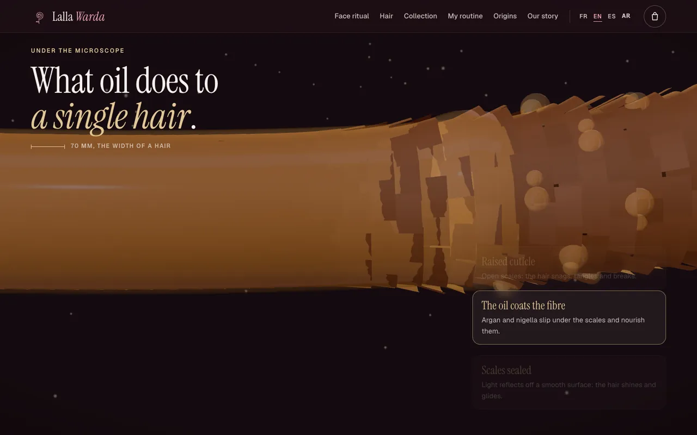<br><sub>A hair under the microscope</sub> |
| 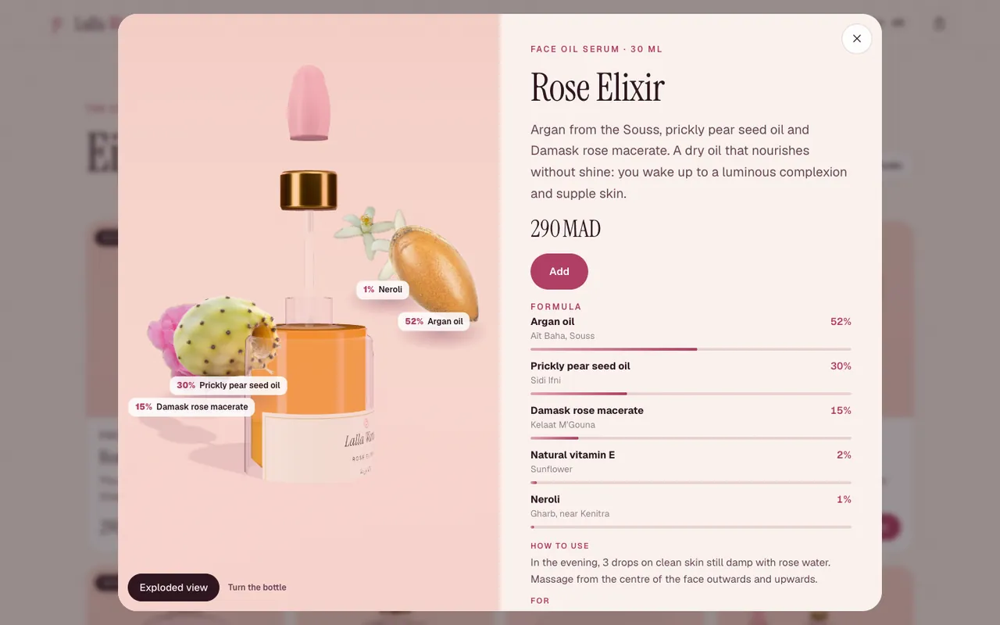<br><sub>Product sheet, exploded view</sub> | 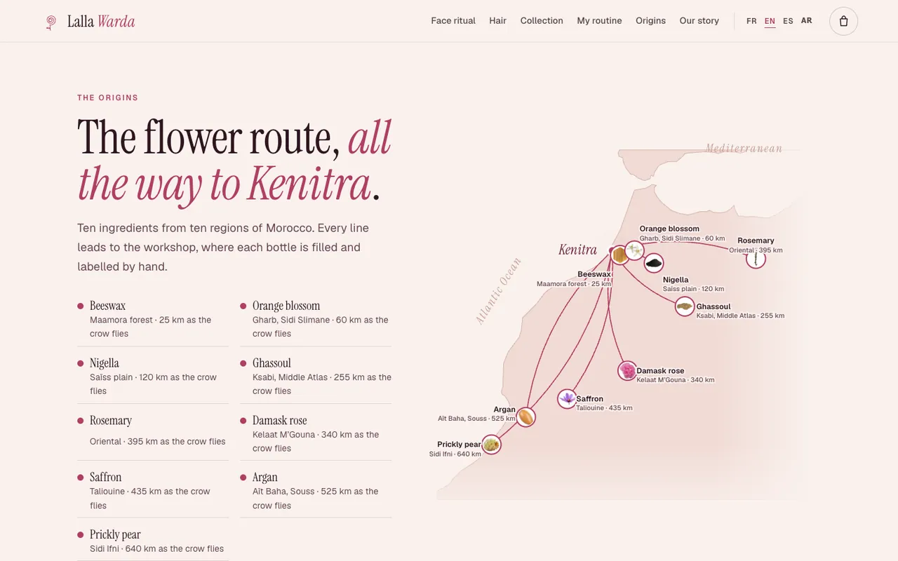<br><sub>The flower route</sub> |

## Promo videos

Three formats of 60 seconds in French, English, Spanish and Arabic, rendered frame by frame from the site’s own 3D scenes, with music and sound effects synthesised from scratch (no samples, no copyrighted audio). Click a poster to play the video.

| Landscape · 16:9 | Feed · 4:5 | Vertical · 9:16 |
| :---: | :---: | :---: |
| <a href="https://hoshuko.github.io/lalla-warda/media/video/169-en.mp4">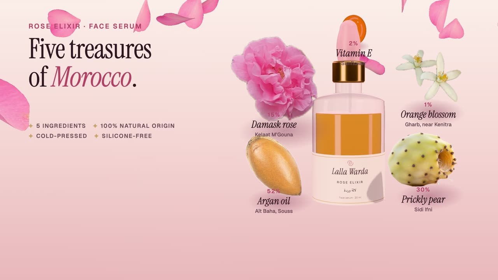</a> | <a href="https://hoshuko.github.io/lalla-warda/media/video/45-en.mp4">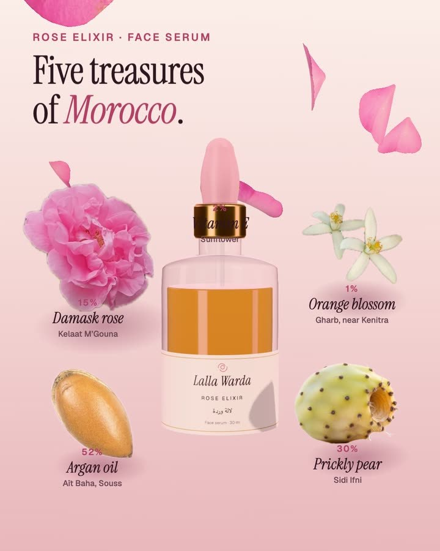</a> | <a href="https://hoshuko.github.io/lalla-warda/media/video/916-en.mp4">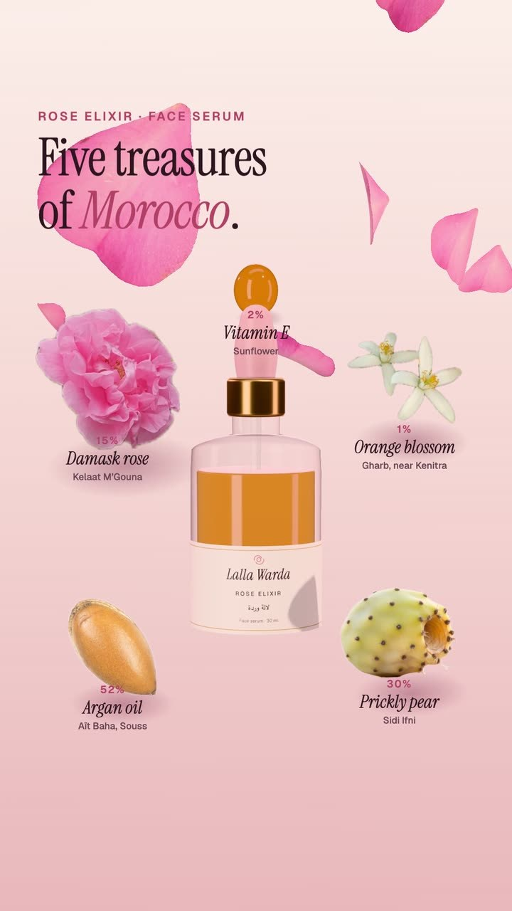</a> |
| <sub>YouTube, websites</sub> | <sub>Facebook & Instagram feeds</sub> | <sub>Reels, Stories, WhatsApp</sub> |

Other languages (16:9): [FR](https://hoshuko.github.io/lalla-warda/media/video/169-fr.mp4) · [ES](https://hoshuko.github.io/lalla-warda/media/video/169-es.mp4) · [AR](https://hoshuko.github.io/lalla-warda/media/video/169-ar.mp4)

## Languages

The site ships in French (`index.html`, default), English (`en.html`), Spanish (`es.html`) and Arabic (`ar.html`, right to left). Each language is a static page, so search engines and link previews see the right text; the language switcher sits in the navigation.

## Under the hood

- [Three.js](https://threejs.org/) (MIT, bundled in `assets/js/three.min.js`, only the parts in use) for the rose, the glass bottles, the ingredients, the hair fibre and the product viewer. The rose petals are deformed on the CPU from a real petal photo; the glass uses a Fresnel edge and a transmissive liquid in a studio environment.
- The textures are a WebGL shader over a real skin photo: a height map drawn along the gesture gives the relief, the highlights and the refraction. The face ritual is drawn on a canvas with masks traced from face landmarks.
- Plain JavaScript modules, no framework and no build step to run it. Content and interface text live in one file per language (`assets/js/config.fr.js · config.en.js · config.es.js · config.ar.js`).
- Without WebGL, the site shows photos and still images instead of the 3D scenes; `prefers-reduced-motion` is respected, and the layout is checked from 360 px wide, in both directions.
- Privacy by design: no cookies, no analytics, no third-party requests and a strict Content Security Policy. The cart is kept in the browser (`localStorage`) and nothing leaves it until the visitor opens WhatsApp.

## Run it locally

The pages use JavaScript modules, so open them through a web server rather than as files. With Python:

```bash
git clone https://github.com/hoshuko/lalla-warda.git
cd lalla-warda
python3 -m http.server 8000
```

Then open <http://localhost:8000>. To publish it, upload the folder to any static host (GitHub Pages, Netlify, Apache, Nginx…).

## Make it yours

All the content is in `assets/js/config.fr.js`, `config.en.js`, `config.es.js` and `config.ar.js`: brand, contact details (WhatsApp, Instagram), currency and delivery, the eight products with their formulas, INCI lists and bottle shapes and colours, textures, ritual steps, routine finder, origins with their coordinates, key figures, reviews, FAQ and interface text. `demo: true` shows the demo notice and keeps the WhatsApp and Instagram buttons from leaving the page; set it to `false` once the real details are in. Page copy is in the HTML pages and the colours are CSS variables at the top of `assets/css/style.css`.

## Credits

Photos come from Unsplash and Wikimedia Commons, and the map from Natural Earth; full attributions are in [CREDITS.md](CREDITS.md). Images adapted from CC BY-SA originals remain under that licence. Fonts are under the SIL Open Font License 1.1 ([`assets/fonts/OFL.txt`](assets/fonts/OFL.txt)); Three.js is under the MIT licence ([`assets/js/three.LICENSE.txt`](assets/js/three.LICENSE.txt)). The brand, its founder, the products, prices, phone number and reviews are fictional.

## License

The code is released under the [PolyForm Noncommercial License 1.0.0](LICENSE). You may use, study and modify it for any non-commercial purpose: personal projects, learning, teaching, charities. Commercial use, such as delivering this template to a paying client, requires a separate licence: open an issue on this repository to ask. Photos and fonts keep their own licences (see above).

## Security

Found a vulnerability? Please report it privately from the repository’s **Security** tab (“Report a vulnerability”) rather than in a public issue. See [SECURITY.md](SECURITY.md).

## More templates

Part of **Storefronts in motion**, a series of scroll-animated website templates for local businesses:

- **[Maison Billot](https://github.com/hoshuko/maison-billot/blob/main/README.md)**: A scroll-animated website for an artisan butcher: beef explained cut by cut.
- **[Tafat](https://github.com/hoshuko/tafat/blob/main/README.md)**: A website for a women-run home cleaning team on the Kabylian coast: a squeegee wipes the window clean as you scroll.
- **[Atelier Nacre](https://github.com/hoshuko/atelier-nacre/blob/main/README.md)**: A website for a nail studio in Bordeaux: a gel set taken apart layer by layer, a colour try-on and online booking.

Portfolio: <https://hoshuko.github.io/en.html> · YouTube: <https://www.youtube.com/@Hosh-uko>
